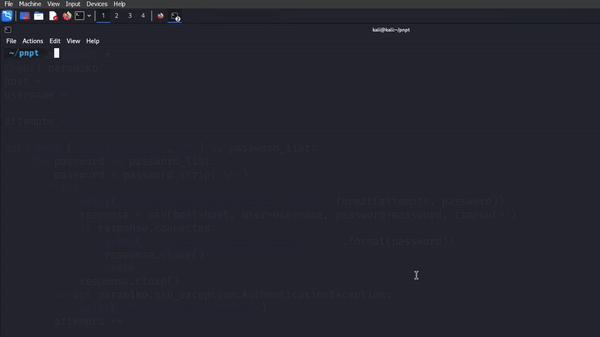

# SSH bruteforcing tool
Simple SSH brute forcing tool in python



```bash 
git clone https://github.com/trixtertrap/ssh-bruteforce.git```

# Prerequisist

Install the Pwn and Paramiko modules

```bash
pip3 install pwn paramiko```

# Usage 

Change the host and the target values in the file

Use custom password files or use the files like rockyou for the password list

Run the program 

```bash
python3 ssh-brute.py```


